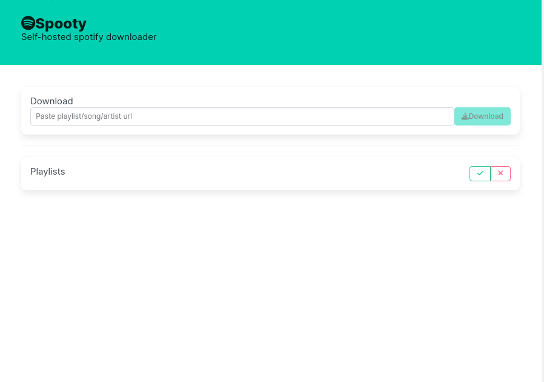

[](https://hub.docker.com/repository/docker/raiper34/spooty/general)
[](https://hub.docker.com/repository/docker/raiper34/spooty/general)
[](https://hub.docker.com/repository/docker/raiper34/spooty/general)
[](https://spooty.netlify.app)
[](https://github.com/Raiper34/spooty)
[](https://github.com/Raiper34/spooty)


# Spooty - selfhosted Spotify downloader
Spooty is a self-hosted Spotify downloader.
It allows download track/playlist/album from the spotify url.
It can also subscribe to a playlist or author page and download new songs upon release.
The project is based on NestJS and Angular. 



### Content
- [🚀 Instalation](#-instalation)
- [📚 Documentation](#-documentation)
- [📖 License](#-license)

# 🚀 Instalation
Recommended and the easiest way how to start to use of Spooty is using docker.
```shell
docker run -d -p 3000:3000 -v /path/to/downloads:/spooty/backend/downloads raiper34/spooty:latest
```

# 📚 Documentation
For more details and complete documentation check: https://spooty.netlify.app/

# 📖 License
MIT
